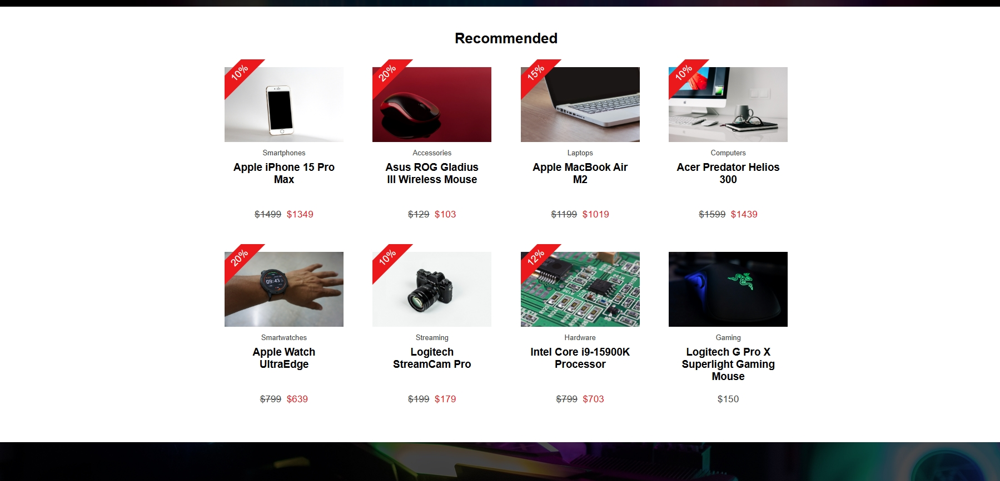
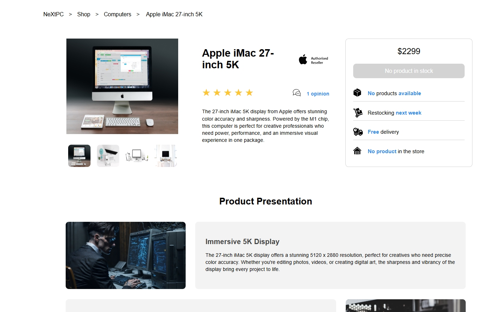
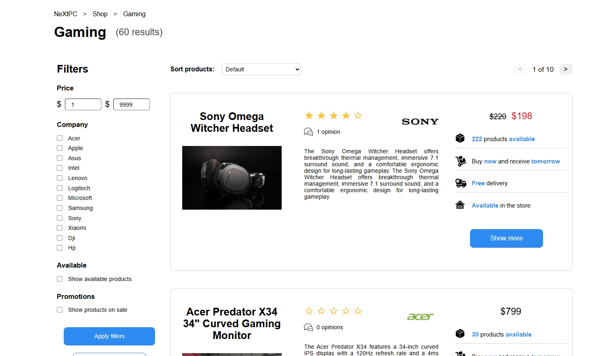
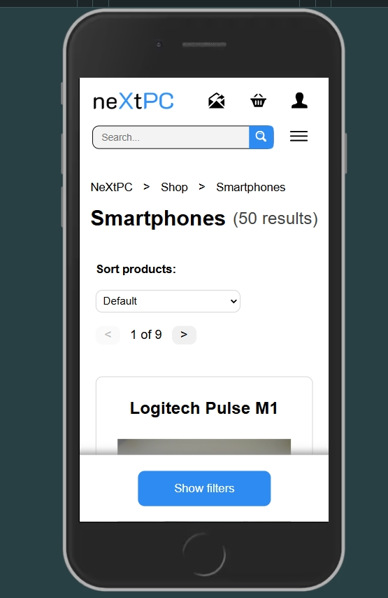

<h1>NeXtPC ecommerce app</h1>

I would like to present with the greatest pleasure my most advanced project, which is a fully functional ecommerce website selling electronic items. I created the entire project from scratch: the frontend was written in Next.js (also Typescript), the backend in Node.js using Express.js and Mongoose, also I used a MongoDB database (REST API). The page is fully responsive - for mobiles, tablets and desktops. The application contains many pages - starting with the home page through individual product categories, sub-pages with individual products, where you can rate the products, the ability to log in/register, and the entire process of buying a product up to payment (which, of course, since this is not a full-fledged application, ends when you have to pay for the product). Being logged in allows you to add products to your favorites, save your data and track products later.

Check out the live demo hosted on Vercel: <a href='https://nextpc.vercel.app/'>NeXtPC ecommerce app</a>

<h2>📫 Project contains</h2>

<ul>
  <li>Homepage, shop page, category pages, product pages, and more</li>
  <li>Custom backend for managing CRUD operations (orders, login, cart, favorites, comments)</li>
  <li>REST API using MongoDB to store and manage data</li>
  <li>Login/registration with user data editing</li>
  <li>Full cart functionality, order handling, and checkout process</li>
  <li>Ability to search products by name</li>
  <li>Frontend and backend security to prevent invalid data, plus cookie support</li>
  <li>Fully responsive design</li>
  <li>Accessibility-friendly practices</li>
  <li>SEO-optimized structure</li>
  <li>Follows core design principles</li>
  <li>Custom 404 and 500 pages</li>
</ul>

<h2>🛠 Tools and Technologies</h2>

<ul>
  <li>React</li>
  <li>Next.js</li>
  <li>Node.js</li>
  <li>Express.js</li>
  <li>Mongoose / MongoDB database</li>
  <li>TypeScript</li>
  <li>JavaScript</li>
  <li>Git / GitHub</li>
</ul>

 
 
 
 

